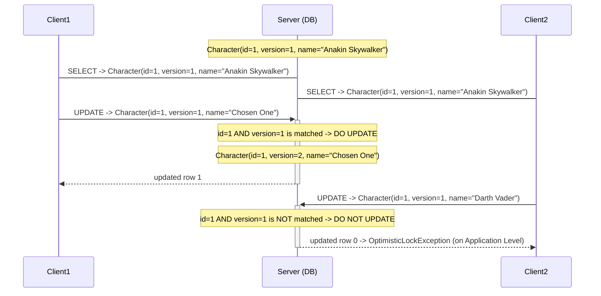
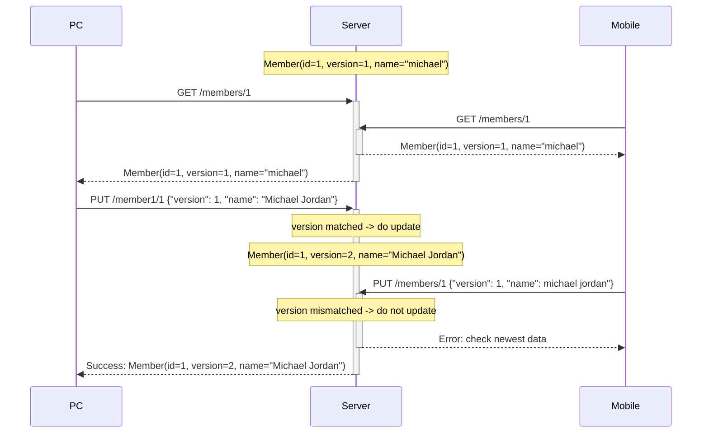
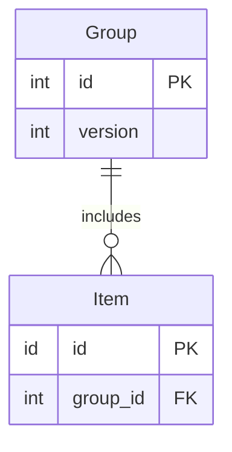
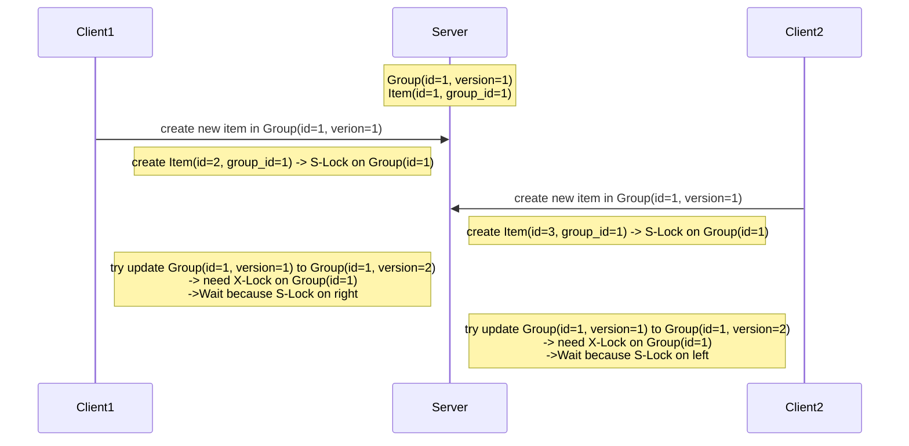
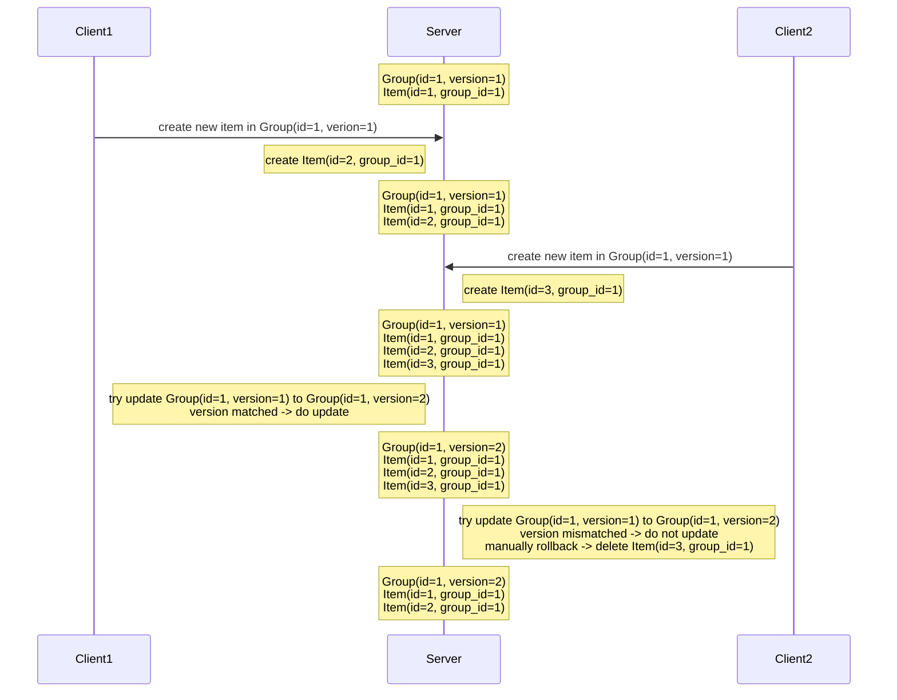

# 낙관적 Lock 톺아보기

## TL;DR

## 사용 방법

- 데이터를 조회할 때 버전 정보를 같이 조회합니다.
- 데이터 수정 요청을 보낼 때 수정 내용과 현재 버전을 같이 보냅니다.
- 데이터를 수정할 때 요청 내용에 있는 버전과 현재 버전이 일치하는지 검사합니다.
- 일치한다면 데이터를 수정하고 버전을 증가시킵니다.
- 일치하지 않는다면 예외를 던집니다.

추가 고려 사항:

- 버전을 꼭 정수로 할 필요는 없습니다. 타임스탬프나 해시값을 사용할 수도 있습니다.
- 버전 업데이트를 읽기 작업할 때 수행할 수도 있습니다.
- 충돌이 발생했을 때 애플리케이션에서 롤백 등 필요한 작업을 수동으로 처리해야 합니다.

예시 설명: 시퀸스 다이어그램의 흐름을 설명합니다.

- Client1이 Character 엔티티를 조회합니다. (version = 1)
- Client2가 Character 엔티티를 조회합니다. (version = 1)
- Client1이 Character의 name을 변경합니다. 데이터 변경과 함께 버전이 올라갑니다. (version = 2)
- Client2가 Character의 name을 변경하려고 시도합니다. Client2의 버전은 1이고 현재 버전은 2이기 때문에 실패합니다.

## 언제 사용할까?

- 동시 수정으로 인한 충돌이 거의 발생하지 않을 거라고 **낙관적**으로 생각할 수 있을 때 사용합니다.
- 조회 API 이후 수정 API를 요청할 때 두 API 사이에서 정합성을 유지해야 할 때 사용할 수 있습니다.

예시: 내 정보 수정하기

- 내 정보 수정은 해당 사용자 본인만 가능하기 때문에 여러 기기에서 동시에 작업하지 않는 이상 동시 수정이 발생할 일이 거의 없습니다.
- 사용자에게 응답했던 데이터가 수정 요청을 할 때까지 다른 변경이 없었다는 것을 보장할 수 있습니다.

- 사용자가 PC와 Mobile에서 내 정보를 조회합니다.
- PC와 Mobile에서 각각 이름을 수정합니다.
- PC의 수정 요청이 먼저 도착합니다.
- 요청 데이터의 버전과 현재 버전이 일치하므로 수정을 반영하고 버전을 올립니다.
- Mobile의 수정 요청이 도착합니다.
- PC의 수정 요청을 처리하면서 이미 버전이 올라갔기 때문에 요청 데이터의 버전과 현재 버전이 일치하지 않습니다. 수정 요청을 거절합니다.
- 클라이언트에서 조회한 데이터가 최신일 경우에만 수정하기 때문에 해당 클라이언트에서 확인하지 못 한 수정 사항으로 덮어써지는 문제를 방지합니다.
  (두 번의 갱신 분실 문제 방지)

## 주의 사항

적절하지 않은 상황:

- 예를 들어 100개 한정 상품을 판매하려고 할 때, 동시 주문이 많이 발생하는 경우 첫 주문 요청자를 제외하고 다른 주문 요청은 모두 에러를 응답하거나
  애플리케이션에서 재시도 처리를 해야 합니다.
- 상품 개수가 0이 될 때까지 100번 동안 각 회차의 첫 주문 요청자를 제외하고 다른 모든 요청을 거절해야 합니다.
- 실패했던 주문 요청을 계속 재시도하면서 시스템에 부하를 일으킬 수 있습니다.
- 사용자에게도 좋지 않은 경험을 줍니다.
- 동시 요청이 많이 일어나고 자주 충돌이 발생하는 상황에서는 낙관적 락 대신 비관적 락 같은 다른 방법을 사용하는 것이 좋습니다.

트랜잭션과 데드락: [이 블로그 글](https://0soo.tistory.com/214)을 통해 데드락 위험을 알게 되었습니다.

- 낙관적 락은 충돌이 발생했을 때 롤백 처리를 수동으로 해야 합니다.
- DB 트랜젝션 안에서 여러 데이터를 수정하려고 하면 DB 종류에 따라 데드락이 발생할 수 있습니다.

예시:

- Client1, Client2가 동시에 요청하는 상황에서 DB 트랜잭션과 낙관적 락을 사용하는 경우입니다.
- MySQL DB에서는 INSERT, UPDATE, DELETE 하는 행에 FK 컬럼이 있는 경우 FK 컬럼의 대상 행에 대해 S-Lock을 겁니다.
- 위 경우 새 Item을 INSERT하는 과정에서 Group에 대해 S-Lock을 겁니다.
- S-Lock끼리는 중복 획득이 가능하므로 Client1, Client2모두 S-Lock은 획득합니다.
- Client1쪽에서 Group의 버전을 올리기 위해 UPDATE할 때 X-Lock을 획득하려고 합니다.
- Client2쪽 트랜잭션에서 S-Lock을 걸었기 때문에 해당 락이 풀릴 때까지 대기합니다.
- Client2쪽에서도 Group의 버전을 올리기 위해 UPDATE할 때 X-Lock을 획득하려고 합니다.
- Client1쪽 트랜잭션에서 S-Lock을 걸었기 때문에 해당 락이 풀릴 때까지 대기합니다.
- 교착 상태에 빠집니다.

원인 및 해결 1:

- 비관적 락을 사용해서 일반적인 트랜잭션 처리 흐름을 따릅니다.
- Client1쪽에서 처음에 SELECT ~ FOR UPDATE 로 Group에 대해 X-Lock을 획득합니다.
- Client2쪽에서도 처음에 SELECT ~ FOR UPDATE 로 Group에 대해 X-Lock을 획득하려고 시도합니다.
- Client2쪽에서는 Client1쪽에서 모든 처리를 완료하고 Group에 대한 X-Lock을 반납할 때까지 대기합니다.
- 교착 상태가 발생하지 않습니다.

원인 및 해결 2:

- DB 트랜잭션을 사용하지 않습니다.
- 충돌이 발생하면 수동으로 해결합니다.

- 일시적으로 데이터 정합성이 깨질 수 있지만 최종적으로 데이터 정합성을 유지합니다.
- 네트워크 오류 등 현실 세계에서 발생할 수 있는 다른 예외는 이 글의 범위를 벗어나기 때문에 생략했습니다.

## Reference

- https://0soo.tistory.com/214
- https://dev.mysql.com/doc/refman/8.0/en/innodb-locks-set.html
