# Exploring Optimistic Locking

## TL;DR

## How to Use

- Include version information when querying data.
- Send both the update content and the current version when sending a update request.
- Check if the version in the request matches the current version when updating data.
- If they match, update the data and increment the version.
- If they don't match, throw an exception.

Additional considerations:

- The version doesn't have to be an integer. Timestamps or hash values can also be used.
- Version updates can also be performed during read operations.
- When a conflict occurs, manual handling such as rollback needs to be done at the application level.

Example explanation: Explains the flow of the sequence diagram.

- Client1 queries the Character entity (version = 1).
- Client2 queries the Character entity (version = 1).
- Client1 updates the name of Character. The version is incremented along with the data update (version = 2).
- Client2 attempts to update the name of Character. Client2's version is 1, and the current version is 2, so the attempt
  fails.

## When to Use

- Use when you can **optimistically** assume that conflicts due to concurrent modifications are unlikely to occur.
- Can be used when maintaining consistency between two API calls, such as a query API followed by a update API.

Example: Updating my information

- Updating my information is possible only for the user themselves, so concurrent modifications are highly unlikely
  unless multiple devices are used simultaneously.
- It can ensure that there were no other changes to the data until the modification request is made.

- The user reads their information from PC and Mobile.
- The user updates the name from both PC and Mobile.
- The update request from PC arrives first.
- The version in the request matches the current version, so the update is applied, and the version is
  incremented.
- The update request from Mobile arrives.
- Since the version has already been updated by the PC request, the version in the request does not match the current
  version, and the update request is rejected.
- By allowing update only if the data retrieved by the client is the most up-to-date, it prevents overwriting with
  update not seen by the client (preventing second lost updates problem).

## Considerations

Inappropriate situations:

- For example, when trying to sell 100 limited products and there are many concurrent orders, all orders except the
  first order requester must respond with an error or handle retries in the application.
- Until the product count reaches 0, you need to reject all requests except for the first order request in each of the
  100 times.
- Continuously retrying failed order requests can put a strain on the system.
- It provides a poor experience to the users.
- In situations where there are many concurrent requests and frequent conflicts, it is better to use a different
  approach like pessimistic locking instead of optimistic locking.

Transactions and Deadlocks: I learned about the risk of deadlocks
through [this blog post](https://0soo.tistory.com/214).

- With optimistic locking, manual rollback needs to be done when a conflict occurs.
- If you try to modify multiple data within a DB transaction, a deadlock can occur depending on the type of the DB.

Example:

- This is a situation where Client1 and Client2 make concurrent requests using DB transactions and optimistic locking.
- In MySQL DB, when there is an FK column in the row being inserted, updated, or deleted, a S-Lock is placed on the
  referenced row.
- In the above case, a S-Lock is placed on Group during the process of inserting a new Item.
- Since S-Locks can be acquired in duplicate, both Client1 and Client2 acquire S-Locks.
- On the Client1 side, when trying to UPDATE the Group's version to 2, it attempts to acquire an X-Lock on Group, but
  since Client2 had a S-Lock, it waits until the lock is released.
- On the Client2 side, it also attempts to acquire an X-Lock on Group to update the version to 2, but it waits due to
  Client1's S-Lock.
- It ends up in a deadlock.

Cause and Solution 1:

- Use pessimistic locking to follow the general transaction processing flow.
- Initially, Client1 acquires an X-Lock on Group using SELECT ~ FOR UPDATE.
- Client2 also attempts to acquire an X-Lock on Group using SELECT ~ FOR UPDATE.
- Client2 waits until Client1 completes all processing and releases the X-Lock on Group.
- Deadlock does not occur.

Cause and Solution 2:

- Do not use DB transactions.
- Handle conflicts manually when they occur.

```mermaid
sequenceDiagram
    participant C1 as Client1
    participant S as Server
    participant C2 as Client2
    Note over S: Group(id=1, version=1)<br/>Item(id=1, group_id=1)
    C1 ->> S: create new item in Group(id=1, verion=1)
    Note left of S: create Item(id=2, group_id=1)
    Note over S: Group(id=1, version=1)<br/>Item(id=1, group_id=1)<br/>Item(id=2, group_id=1)
    C2 ->> S: create new item in Group(id=1, version=1)
    Note right of S: create Item(id=3, group_id=1)
    Note over S: Group(id=1, version=1)<br/>Item(id=1, group_id=1)<br/>Item(id=2, group_id=1)<br/>Item(id=3, group_id=1)
    Note left of S: try update Group(id=1, version=1) to Group(id=1, version=2)<br/>version matched -> do update
    Note over S: Group(id=1, version=2)<br/>Item(id=1, group_id=1)<br/>Item(id=2, group_id=1)<br/>Item(id=3, group_id=1)
    Note right of S: try update Group(id=1, version=1) to Group(id=1, version=2)<br/>version mismatched -> do not update<br/>manually rollback -> delete Item(id=3, group_id=1)
    Note over S: Group(id=1, version=2)<br/>Item(id=1, group_id=1)<br/>Item(id=2, group_id=1)
```

- Data consistency may temporarily be compromised, but eventually, data consistency is maintained.
- The article skips real-world exceptions such as network errors, etc., which can occur beyond the scope of this
  article.

## Reference

- https://0soo.tistory.com/214
- https://dev.mysql.com/doc/refman/8.0/en/innodb-locks-set.html
