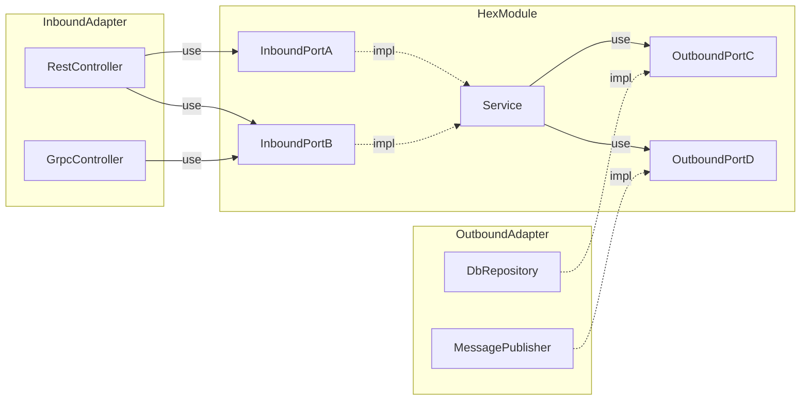
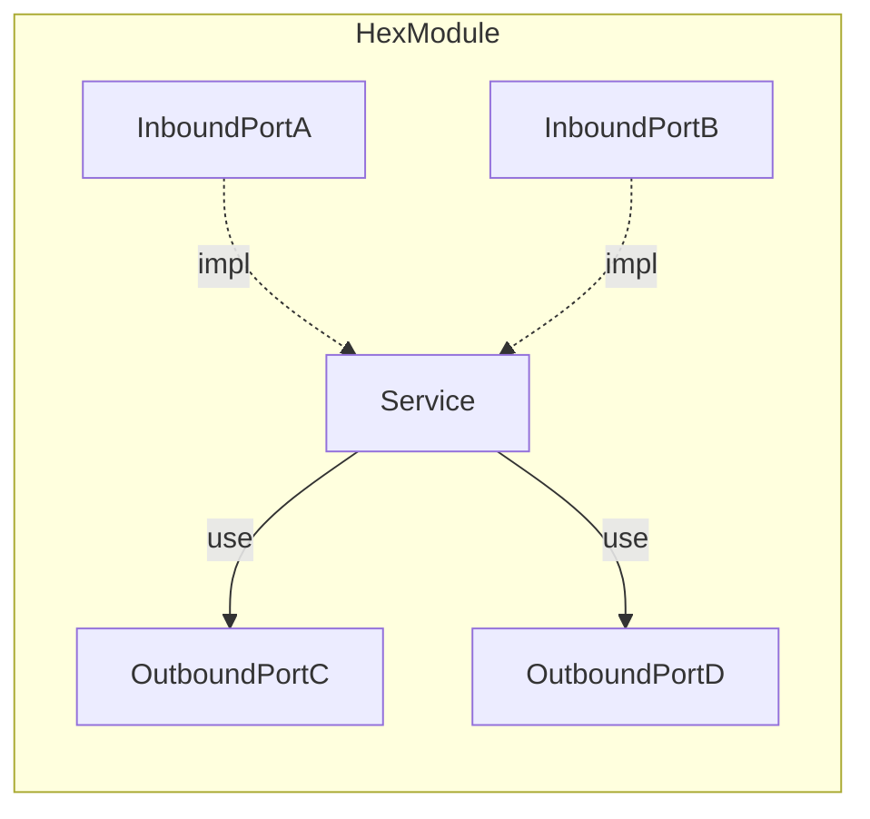
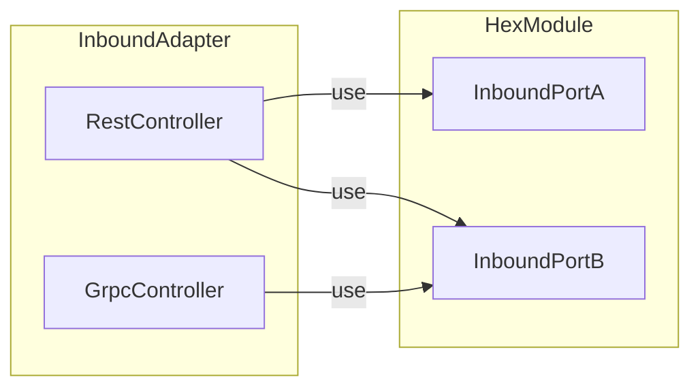
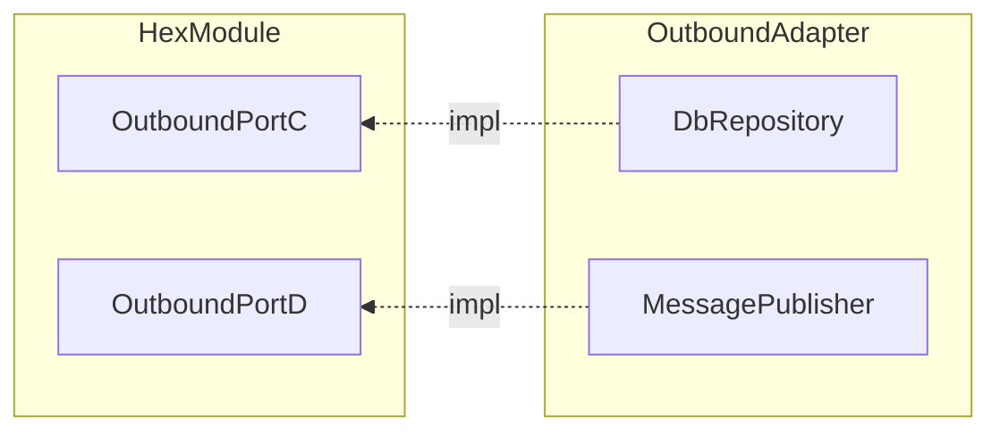

# 헥사고날 아키텍처 톺아보기

## TL;DR



- Mermaid 플로우 차트에서 화살표 방향을 변경하기 어려워서 OutboundAdapter 쪽 표현이 어색합니다.
- 부분별로 따로 살펴보면 좀 더 이해하기 편합니다.

Hexagonal Module:



Hexagonal Module <-> InboundAdapter:



Hexagonal Module <-> OutboundAdapter:



## 소개

- 포트 & 어댑터 패턴으로도 불립니다. 클린 아키텍처와 주요 개념을 공유합니다.
- 모듈 내부와 외부가 주고받는 메시지를 모두 인터페이스로 선언합니다.
- 이를 통해 유연한 코드 구조를 확보하고 변경 전파를 최소화합니다.

## InboundPort

- 모듈의 사용 방법을 인터페이스로 제공합니다.
- 모듈 외부에서는 항상 제공된 인터페이스를 통해서만 해당 모듈을 사용할 수 있습니다.

예시 1: 모듈 내부의 인터페이스 구현체에서 로직을 수정하거나 구현체를 교체해도 해당 인터페이스를 사용하던 모듈 외부 코드에는 영향이 없습니다.

아래와 같은 `OrderInboundPort`가 있을 때:

```java
package sample.hexmodule;

public interface OrderInboundPort {
    void order(OrderDto orderDto);
}
```

구현 클래스를 완성하지 않았어도 `MockOrderService`를 만들어 `OrderInboundPort`를 사용하는 `RestController`를 먼저 개발할 수 있습니다.

```java
package sample.hexmodule;

@Slf4j
@Service
public class MockOrderService implements OrderInboundPort {
    @Override
    public void order(OrderDto orderDto) {
        log.info("주문하기: {}", orderDto);
    }
}
```

```java
package sample.inboundadapter;

@RequiredArgsConstructor
public class RestController {
    private final OrderInboundPort orderInboundPort;

    @PostMapping("/orders")
    public ResDto order(@RequestBody ReqDto reqDto) {
        // ...
        this.orderInboundPort.order(orderDto);
        // ...
    }
}
```

실제 구현 클래스를 작성한 후 `RestController` 코드를 변경할 필요 없이 `MockOrderService` 대신 `OrderService`를 의존성으로 주입할 수 있습니다.

```java
package sample.hexmodule;

/**
 * MockOrderService는 스프링 빈 등록에서 제외하거나 삭제
 */
@Slf4j
@Service
public class OrderService implements OrderInboundPort {
    @Override
    public void order(OrderDto orderDto) {
        // ...
    }
}
```

예시 2: 해당 인터페이스를 사용하는 모듈 외부 코드를 수정해도 모듈 내부의 코드에는 영향이 없습니다.

예시 1에서 `RestController` 대신 `GrpcController`로 교체해도 `OrderInboundPort`, `OrderService`는 수정할 필요가 없습니다.

```java
package sample.inboundadapter;

@GrpcService
public class GrpcController extends SimpleGrpc.SimpleImplBase {
    private final OrderInboundPort orderInboundPort;

    // constructor

    @Override
    public void order(OrderRequest request, StreamObserver<OrderReply> responseObserver) {
        OrderReply reply = OrderReply.newBuilder()
                // do operations with this.orderInboundPort...
                .build();
        responseObserver.onNext(reply);
        responseObserver.onCompleted();
    }
}
```

## OutboundPort

- 모듈 내부에서 모듈 외부의 기능을 사용하는 방법을 인터페이스로 제공합니다.
- 모듈 내부에서는 항상 제공된 인터페이스를 통해서만 외부 기능을 사용할 수 있습니다.

예시 3: 모듈 외부의 인터페이스 구현체에서 로직을 수정하거나 구현체를 교체해도 해당 인터페이스를 사용하던 모듈 내부 코드에는 영향이 없습니다.

`OrderService`가 DB에 데이터를 저장하기 위해 `DbOrderRepository`를 사용할 때:

```java
package sample.hexmodule;

public interface OrderRepository {
    void save(Order order);
}
```

```java
package sample.hexmodule;

@Slf4j
@RequiredArgsConstructor
@Service
public class OrderService implements OrderInboundPort {
    private final OrderRepository orderRepository;

    @Override
    public void order(OrderDto orderDto) {
        // ...
        this.orderRepository.save(order);
        // ...
    }
}
```

```java
package sample.outboundadapter;

@Repository
public class DbOrderRepository implements OrderRepository {
    private final JdbcTemplate template;

    // constructor

    @Override
    public void save(Order order) {
        // ...
        this.template.update(sql, order);
        // ...
    }
}
```

- `OrderService`를 테스트하기 위해서는 항상 DB에 연결해야 합니다.
- 이때, `MockOrderRepository`를 `OrderService`에 주입하면 DB에 연결하지 않고 Mock 객체를 사용해 테스트를 진행할 수 있습니다.
- 주입되는 의존 객체를 교체해도 인터페이스를 유지하기 때문에 `OrderService` 코드를 수정할 필요가 없습니다.

```java
package sample.outboundadapter;

/**
 * 테스트 환경에서 DbOrderRepository 대신 MockOrderRepository 를 스프링 빈으로 등록하거나
 * OrderService의 생성자에 직접 MockOrderRepository를 의존성으로 주입
 */
@Slf4j
@Repository
public class MockOrderRepository implements OrderRepository {
    @Override
    public void save(Order order) {
        log.info("주문 저장: {}", order);
    }
}
```

- 이런 방법으로 DB나 메시지 큐처럼 테스트 환경에서 사용하기 어려운 인프라 기술을 Mock 객체로 대체해 손쉽게 테스트를 수행할 수 있습니다.

## 의존 관계 방향성

- 인터페이스는 모듈 내부에 위치하고 구현체는 모듈 외부에 위치합니다.
- 의존성이 항상 모듈 외부에서 모듈 내부로 향합니다.
- 이를 통해 모듈 내부의 비즈니스 로직을 담당하는 코드가 외부 기술, 구현체에 의존하지 않도록 합니다.

## 장점

- 의존성 방향이 모듈 외부에서 모듈 내부로 향하기 때문에 모듈 외부 코드가 수정될 때 모듈 내부의 도메인 로직 코드를 같이 수정해야 하는 일을 방지할 수 있습니다.
- 모듈 내부와 외부 사이의 상호작용을 모두 인터페이스로 선언했기 때문에 유연한 애플리케이션 구조를 갖게 되고 테스트, 기능 확장이 쉬워집니다.
- 인터페이스를 기준으로 동시에 여러 코드를 작업하기 쉬워집니다. 인터페이스 사용 객체와 인터페이스 구현 객체를 두 사람이 동시에 작업할 수 있습니다.

## 단점

- OutboundPort에서 사용한 의존성 역전 원칙이 이해하기 어려울 수 있습니다.
- 작성할 코드가 많아질 수 있습니다.
- 전체 애플리케이션의 구조나 실행 흐름을 파악하기 어려워집니다.
- 라이브러리나 프레임워크를 사용하는 모든 코드를 OutboundPort를 통해 밖으로 밀어내려고 하면 애플리케이션의 복잡도가 기하급수적으로 커질 수 있습니다.
  어떤 코드를 OutboundPort를 통해 사용하고 어떤 코드를 HexModule안에서 직접 사용할지 상황에 맞게 조절해야 합니다.
