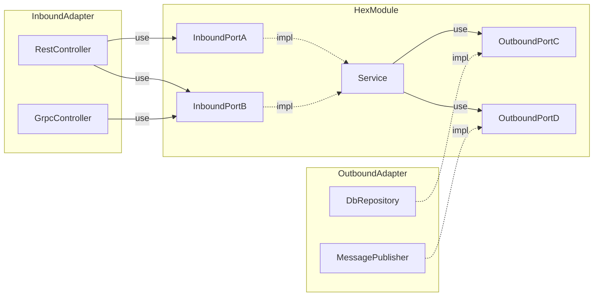
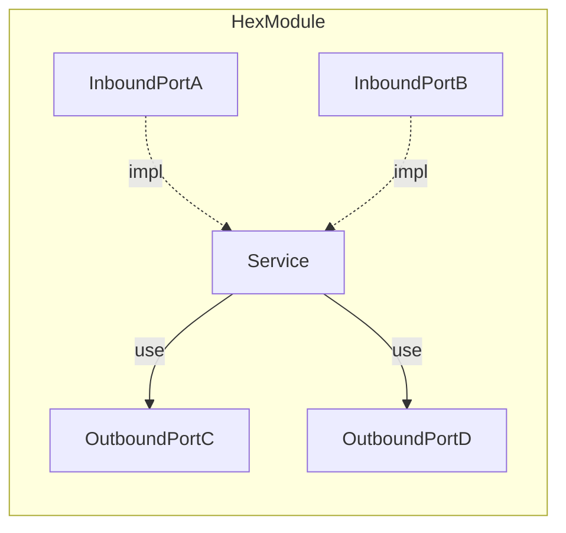
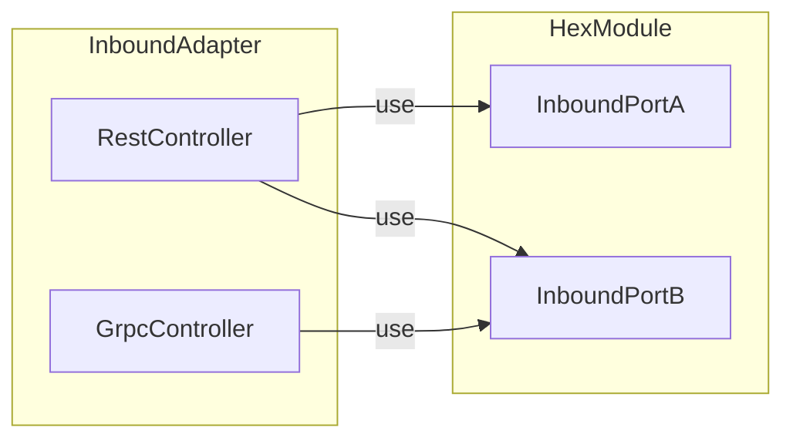
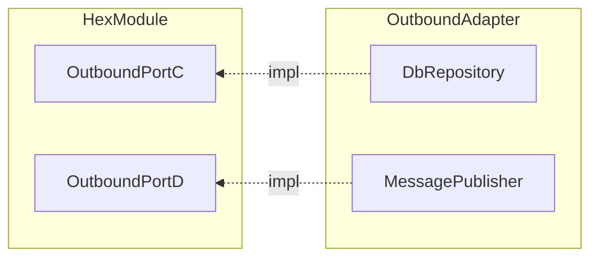

# Exploring Hexagonal Architecture

## TL;DR



- The representation of OutboundAdapter in the Mermaid flowchart appears awkward
  due to difficulties in changing the arrow directions.
- Show each part separately for easy understanding.

Hexagonal Module:



Hexagonal Module <-> InboundAdapter:



Hexagonal Module <-> OutboundAdapter:



## Introduction

- Also known as the Ports and Adapters pattern, it shares concepts with the Clean Architecture.
- Declares all messages exchanged between the internal and external of the module as interfaces.
- Ensures a flexible code structure and minimizes propagation of changes.

## InboundPort

- Provides the usage of the module as an interface.
- External components can only use the module through the provided interfaces.

Example 1: When there is an `OrderInboundPort` as follows:

```java
package sample.hexmodule;

public interface OrderInboundPort {
    void order(OrderDto orderDto);
}
```

Even if the implementation class is not completed,
you can develop the `RestController` that uses the `OrderInboundPort` by creating a `MockOrderService`.

```java
package sample.hexmodule;

@Slf4j
@Service
public class MockOrderService implements OrderInboundPort {
    @Override
    public void order(OrderDto orderDto) {
        log.info("order: {}", orderDto);
    }
}
```

```java
package sample.inboundadapter;

@RequiredArgsConstructor
public class RestController {
    private final OrderInboundPort orderInboundPort;

    @PostMapping("/orders")
    public ResDto order(@RequestBody ReqDto reqDto) {
        // ...
        this.orderInboundPort.order(orderDto);
        // ...
    }
}
```

After completing the actual implementation class,
you can inject `OrderService` as a dependency instead of `MockOrderService`,
without the need to modify the `RestController` code.

```java
package sample.hexmodule;

/**
 * Exclude MockOrderService from Spring bean registration
 */
@Slf4j
@Service
public class OrderService implements OrderInboundPort {
    @Override
    public void order(OrderDto orderDto) {
        // ...
    }
}
```

Example 2: Modifying the external code using this interface does not affect the internal code of the module.

In Example 1, even if you replace `RestController` with `GrpcController`,
`OrderInboundPort` and `OrderService` do not need to be modified.

```java
package sample.inboundadapter;

@GrpcService
public class GrpcController extends SimpleGrpc.SimpleImplBase {
    private final OrderInboundPort orderInboundPort;

    // constructor

    @Override
    public void order(OrderRequest request, StreamObserver<OrderReply> responseObserver) {
        OrderReply reply = OrderReply.newBuilder()
                // do operations with this.orderInboundPort...
                .build();
        responseObserver.onNext(reply);
        responseObserver.onCompleted();
    }
}
```

## OutboundPort

- Provides the method to use external functionalities within the module as an interface.
- Within the module, you can only use external functionalities through the provided interfaces.

Example 3: Even if you modify the logic in the external implementation or replace the implementation,
it does not affect the internal module code that uses this interface.

When `OrderService` uses `DbOrderRepository` to save data to the database:

```java
package sample.hexmodule;

public interface OrderRepository {
    void save(Order order);
}
```

```java
package sample.hexmodule;

@Slf4j
@RequiredArgsConstructor
@Service
public class OrderService implements OrderInboundPort {
    private final OrderRepository orderRepository;

    @Override
    public void order(OrderDto orderDto) {
        // ...
        this.orderRepository.save(order);
        // ...
    }
}
```

```java
package sample.outboundadapter;

@Repository
public class DbOrderRepository implements OrderRepository {
    private final JdbcTemplate template;

    // constructor

    @Override
    public void save(Order order) {
        // ...
        this.template.update(sql, order);
        // ...
    }
}
```

- To test `OrderService`, you always need to connect to the database.
- In this case, by injecting `MockOrderRepository` into `OrderService`,
  you can test using a mock object without connecting to the database.
- Since the interfaces are not changed even when replacing the injected dependency,
  there is no need to modify the `OrderService` code.

```java
package sample.outboundadapter;

/**
 * In the test environment, register MockOrderRepository as a Spring bean instead of DbOrderRepository
 * or inject MockOrderRepository directly as a dependency into the constructor of OrderService.
 */
@Slf4j
@Repository
public class MockOrderRepository implements OrderRepository {
    @Override
    public void save(Order order) {
        log.info("save order: {}", order);
    }
}
```

- In this way, you can easily perform tests using mock objects to replace infrastructure technologies
  that are difficult to use in a test environment, such as a database or a message queue.

## Dependency Direction

- Interfaces are located within the module, and implementations are located outside the module.
- The dependency always points from the outside of the module to the inside.
- This ensures that the code responsible for the business logic inside the module
  does not depend on external technologies or implementations.

## Pros

- Since the dependency direction is always from outside the module to inside the module,
  it prevents the need to modify domain logic code inside the module when external code is modified.
- Having declared interactions between the internal and external using interfaces,
  it provides a flexible application structure and makes testing and feature extensions easier.
- Working with multiple pieces of code based on the interface becomes easier.
  Two people can work simultaneously on the objects using the interface and the objects implementing the interface.

## Cons

- Understanding the inversion of control principle used in OutboundPort can be difficult.
- The amount of code to be written can increase.
- It can be difficult to understand the overall structure and execution flow of the entire application.
- Pushing all code using libraries or frameworks through OutboundPort
  can exponentially increase the complexity of the application.
  You need to adjust according to the situation whether to use OutboundPort to use a specific code
  or use the code directly within HexModule.
