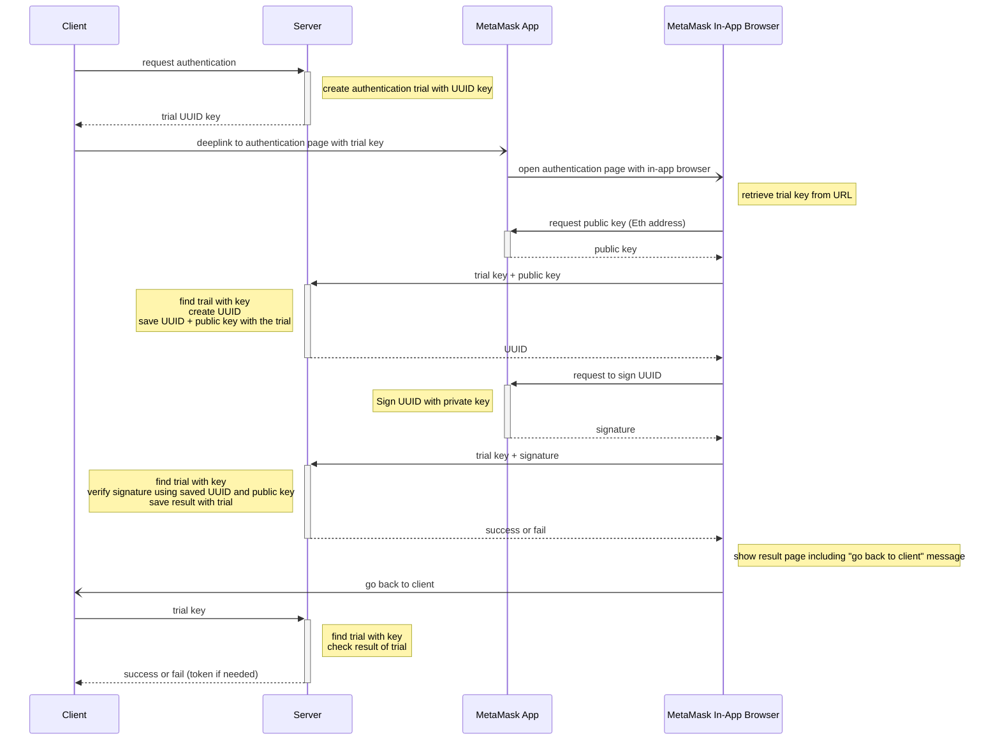

# 모바일 메타마스크 앱으로 지갑 주인 인증하기

## TL;DR

- 아래 시퀸스대로 모바일 메타마스크 앱을 이용해 지갑 주인을 인증할 수 있습니다.
- 이더리움 지갑 주인을 인증하는 원리는 [이전 글](../안전하게%20이더리움%20지갑%20주인%20인증하기/README.md)을 참고해 주세요.

## Problem

- 모바일 환경에서 메타마스크 확장 프로그램은 메타마스크 모바일 앱의 인 앱 브라우저에서만 사용할 수 있습니다.
- 모바일 앱이나 웹 클라이언트에서 직접 사용자에게 public 키를 조회하거나 서명을 요청할 수 없습니다.
- 메타마스크의 인 앱 브라우저에서 인증을 완료해도 클라이언트에서 인증이 유지되지 않습니다.

## Solve

맨 위의 시퀸스 다이어그램과 함께 봐주세요.

액터:

- 클라이언트: 사용자가 사용하는 모바일 앱 또는 웹 앱
- 서버: 인증 서버
- 메타마스크 앱: 모바일 메타마스크 앱
- 인 앱 브라우저: 모바일 메타마스크 앱의 인 앱 브라우저

상황:

- 인 앱 브라우저에서만 메타마스크 확장 프로그램에 접근할 수 있으므로 지갑 주인을 검증하는 과정은 인 앱 브라우저에서 진행해야 합니다.
- 인증 토큰과 같은 인증 결과는 클라이언트에서 사용해야 하므로 최종적으로 인증을 완료하는 과정은 클라이언트에서 진행해야 합니다.

인증 방법

- 클라이언트에서 인증 시퀸스를 요청합니다.
- 서버에서 인증 시도(trial) 데이터를 생성하고 UUID같은 랜덤 값을 생성해 인증 시도의 키로 저장합니다. 인증 시도 키를 클라이언트에게 응답합니다.
- 클라이언트에서 인증 시퀸스 처리 페이지 URL에 인증 시도 키를 붙여 딥링크 URL을 생성해 메타마스크 앱을 호출합니다.
- 메타마스크 앱은 인 앱 브라우저에서 호출받은 URL에 해당하는 인증 시퀸스 처리 페이지를 엽니다.
- 인증 시퀸스 처리 페이지에서 URL에 있는 인증 시도 키를 파싱합니다.
- 인증 시퀸스 처리 페이지에서 메타마스크 앱에 요청해 인증할 지갑의 public 키를 조회합니다.
- 인증 시퀸스 처리 페이지에서 인증 시도 키와 public 키를 서버에 보냅니다.
- 서버에서 인증 시도 키에 맞는 인증 시도를 찾습니다. UUID같은 랜덤 값을 생성해 public 키와 함께 인증 시도에 저장하고 생성한 랜덤 값을 응답합니다.
- 인증 시퀸스 처리 페이지에서 메타마스크 앱에 요청해 응답받은 랜덤 값을 private 키로 서명한 해시값을 만듭니다.
- 인증 시퀸스 처리 페이지에서 인증 시도 키와 생성한 서명 해시값을 서버에 보냅니다.
- 서버에서 인증 시도 키에 맞는 인증 시도를 찾습니다. 해시값이 저장된 랜덤 값에 서명한 것이 맞는지 같이 저장되어 있던 public 키로 검증합니다.
  인증 결과를 인증 시도에 저장하고 인증 결과를 응답합니다.
- 인증 시퀸스 처리 페이지에서 인증 결과에 따라 화면을 업데이트합니다. 사용자에게 클라이언트로 돌아갈 것을 안내합니다.
- 사용자가 클라이언트로 돌아오면 클라이언트에서 인증 결과 키와 함께 인증 시퀸스 완료를 서버에 요청합니다.
- 서버에서 인증 시도 키에 맞는 인증 시도를 찾습니다. 인증 시도에 저장된 인증 결과를 응답합니다. 필요한 경우 인증 토큰을 발급할 수 있습니다.

결과:

- 클라이언트가 지갑 주인 인증 시퀸스를 메타마스크 앱과 인 앱 브라우저에게 위임했습니다.
- 인증 결과는 클라이언트에서만 소비했습니다.

인증 시도 키를 UUID로 만든 이유:

- auto increment 키와 같은 연속적인 값을 키로 사용할 경우 다른 사용자가 인증 시도 키를 예상할 수 있습니다.
- 악의적인 공격으로 인증 시도 결과를 탈취할 수 있습니다.
- auto increment 키를 사용할 경우 UUID 키를 추가로 생성해 검증해야 합니다.

인 앱 브라우저에서 인증 토큰을 발급받고 URL로 클라이언트에 보내지 않은 이유:

- 공격자가 피싱 사이트를 만들어서 사용자의 인증 토큰을 탈취할 수 있습니다.
- 인증 토큰을 다른 곳에 전송하지 마세요.

## Improve

아래 상황에서 인증 시도를 무효로 처리하여 보안을 강화할 수 있습니다.

- 인증 시도에 짧은 만료 시간을 설정해 비정상적으로 오래 걸린 인증 시퀸스는 무효로 처리합니다.
- public 키를 보내는 요청, signature를 보내는 요청, 인증 결과를 소비하는 요청 모두 한 번만 요청할 수 있게 합니다.
  각 요청 여부를 기록해 중복 요청을 받으면 무시하거나 인증 시도 자체를 무효로 처리할 수 있습니다.
- 인증 시도에 접근할 때 항상 무효 여부를 검증합니다.

## Reference

- [이전 글: 안전하게 이더리움 지갑 주인 인증하기](../안전하게%20이더리움%20지갑%20주인%20인증하기/README.md)
