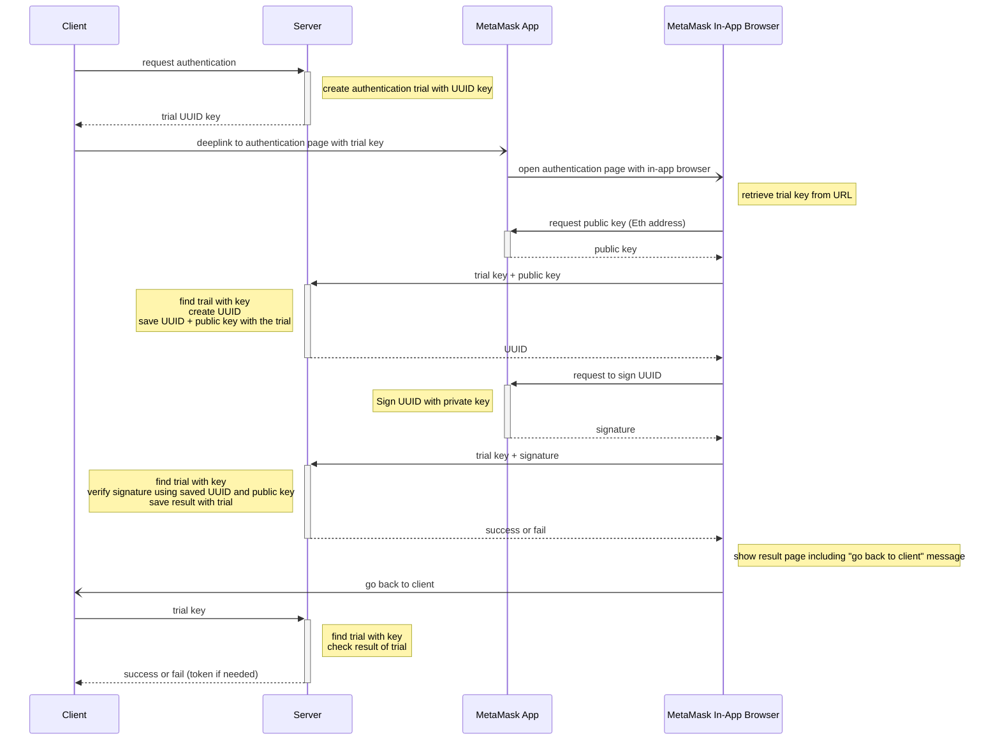

# Authenticate Ethereum Wallet Owner with Mobile MetaMask App

## TL;DR

- You can authenticate the wallet owner using the MetaMask mobile app using the following sequence.
- For the principles of authenticating an Ethereum wallet owner, please refer to
  the [previous post](../안전하게%20이더리움%20지갑%20주인%20인증하기/README_EN.md).

## Problem

- MetaMask extension can only be used in the in-app browser of the MetaMask mobile app in a mobile environment.
- It's not possible for a mobile app or web client to directly request a user's public key or ask for a signature in a
  mobile environment.
- Even if the authentication is completed in the in-app browser of MetaMask, the authentication is not maintained on the
  client.

## Solve

Refer to the sequence diagram at the top.

Actors:

- Client: The mobile app or web app that the user is using.
- Server: The authentication server.
- MetaMask App: The MetaMask mobile app.
- In-App Browser: The in-app browser of the MetaMask mobile app.

Context:

- The verification of the wallet owner needs to be done in the in-app browser since the MetaMask extension can only be
  accessed there.
- The final steps of the authentication, where authentication tokens and results need to be consumed by the client, must
  be done on the client.

Authentication approach:

- The client requests the authentication sequence.
- The server creates an authentication trial and generates a random value like UUID as the key for the trial, then saves
  it. The server responds to the client with the trial's UUID key.
- The client make a deep link URL to the authentication processing page by appending the trial key to the URL and
  invokes the MetaMask app.
- The MetaMask app opens the authentication processing page in the in-app browser according to the received URL.
- The authentication processing page parses the trial key from the URL.
- The authentication processing page requests the MetaMask app to retrieve the public key (Eth address) for the wallet
  to be authenticated.
- The authentication processing page sends the trial key and public key to the server.
- The server finds the authentication trial corresponding to the trial key, creates a UUID-like random value, save
  it with the public key, and responds with the generated random value along with the UUID.
- The authentication processing page requests the MetaMask app to sign the UUID with the private key.
- The authentication processing page sends the trial key and the signed hash of the UUID to the server.
- The server finds the authentication trial corresponding to the trial key, validates if the hash matches the stored
  UUID and public key. The server saves the result with the trial.
- The server responds with the authentication result to the authentication processing page.
- The authentication processing page updates the display based on the authentication result and guide the user to
  return to the client.
- When the user returns to the client, the client requests the completion of the authentication sequence to the server
  with the authentication trial key.
- The server finds the authentication trial corresponding to the trial key, retrieves the authentication result saved in
  the trial, and responds with the authentication result. If needed, it can issue an authentication token.

Outcome:

- The client delegated the wallet owner authentication sequence to the MetaMask app and the in-app browser.
- The authentication result was consumed only by the client.

Reason for using UUID as the authentication trial key:

- Using a continuous value like an auto-incrementing key might allow other users to predict the authentication trial
  key.
- Malicious actors could attack to steal the authentication trial results.
- When using an auto-incrementing key, an additional UUID key needs to be generated and validated for verification.

Reason for not issuing the authentication token and sending it via URL from the in-app browser:

- Attackers could create phishing sites to steal the user's authentication token.
- Do not transmit the authentication token elsewhere.

## Improve

You can enhance security by invalidating the authentication trial under the following circumstances:

- Set a short expiration time for the authentication trial, invalidating authentication sequences that take abnormally
  long.
- Allow each request (requesting public key, sending signature, and consuming authentication result) to be made only
  once. Record whether a request has been made, and if a duplicate request is received, ignore it or invalidate the
  authentication trial itself.
- Always verify the invalidity when accessing the authentication trial.

## Reference

- [Previous Post: Authenticate Ethereum Wallet Owner Securely](../안전하게%20이더리움%20지갑%20주인%20인증하기/README_EN.md)
 