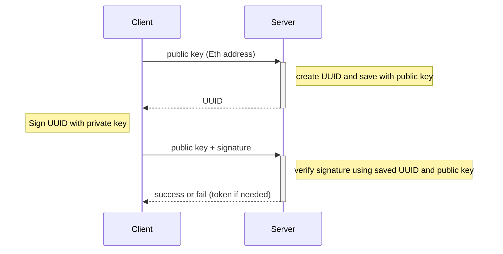

# 안전하게 이더리움 지갑 주인 인증하기

## TL;DR

아래 시퀸스대로 private 키를 요구하지 않고 이더리움 지갑 주인을 인증할 수 있습니다.

## Problem

- 서버에서 이더리움 지갑의 주인인지 확인해야 하는 경우가 있습니다.
- 지갑의 private 키를 요구할 수 없습니다. 모든 지갑 사용자는 private 키를 절대로 노출해선 안 됩니다.
- 지갑의 public 키는 다른 사람도 알 수 있습니다. public 키를 제출했다고 해당 지갑의 주인이라고 판단할 수 없습니다.

## Solve

상황:

- 이더리움 지갑은 비대칭 키로 구성됩니다.
- private 키는 외부에 절대 공개하면 안 됩니다. public 키는 이더리움 지갑 주소로 사용되어 외부에 공개해도 괜찮습니다.
- private 키로 메시지를 서명해 해시값을 만들면, public 키로 해시값을 검증할 수 있습니다.

인증 방법: 맨 위의 시퀸스 다이어그램과 함께 봐주세요.

- 클라이언트에서 인증할 지갑의 public 키와 함께 인증 시퀸스를 요청합니다.
- 서버에서 UUID같은 랜덤 값을 생성해 public 키와 함께 저장하고 생성한 랜덤 값을 응답합니다.
- 클라이언트에서 응답받은 랜덤 값을 private 키로 서명해 해시값을 만들고 public 키와 함께 서버에 보냅니다.
- 서버에서 public 키와 함께 저장했던 랜덤 값을 찾아 해시값이 해당 랜덤 값에 서명한 것이 맞는지 public 키로 검증합니다.
- 인증 결과를 응답합니다. 필요한 경우 인증 토큰을 발급할 수 있습니다.

결과:

- 서버와 클라이언트가 요청과 응답 어디에서도 private 키를 주고받지 않습니다.
- private 키를 가진 사용자만 올바른 서명을 만들 수 있으므로 올바른 서명을 보낸 사용자가 지갑 주인이라고 판단해도 안전합니다.

서명 및 검증하기:

- 서명하고 검증하는 알고리즘을 직접 구현할 필요는 없습니다.
- [ethers](https://docs.ethers.org/), [MetaMask](https://metamask.io/) 같은 이더리움 지갑 애플리케이션에서
  public 키를 조회하고 서명 및 검증하는 기능을 제공합니다.

## Other Usage

- public 키, private 키로 구성된 비대칭 키를 사용하는 경우 같은 방법으로 비대칭 키의 주인을 인증할 수 있습니다.
