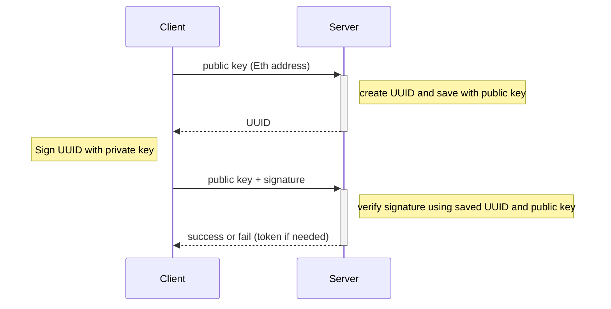

# Authenticate Ethereum Wallet Owner Securely

## TL;DR

You can authenticate the owner of an Ethereum wallet without requesting the private key from the server using the
following sequence:

## Problem

- There are cases where you need to verify if someone is the owner of an Ethereum wallet from your server.
- Requesting the private key of a wallet is not an option; users should never expose their private keys.
- The wallet's public key can be known to others, so submitting a public key does not prove ownership of the associated
  wallet.

## Solve

Context:

- Ethereum wallets use asymmetric cryptography.
- The private key should never be exposed publicly, while the public key is used as the Ethereum wallet address and can
  be safely shared.

Authentication approach: Refer to the sequence diagram at the top.

- The client requests an authentication sequence with the public key of the wallet to be authenticated.
- The server generates a random value like a UUID, save it with the public key, and responds with the generated
  random value.
- The client signs the received random value with their private key, creating a hash, and sends it to the server along
  with the public key.
- The server retrieves the stored random value associated with the public key and verifies if the hash matches the
  stored random value using the public key.
- The server responds with the authentication result and can issue an authentication token if needed.

Outcome:

- At no point in the request and response between the server and the client is the private key exchanged.
- Since only users with the private key can generate a correct signature, it is safe to assume that a user who sends a
  valid signature is the owner of the wallet.

Signing and Verification:

- You don't need to implement the signing and verification algorithms yourself.
- Applications like [ethers](https://docs.ethers.org/) and [MetaMask](https://metamask.io/) provide
  functionalities to retrieve public keys, sign, and verify.

## Other Usage

- When using asymmetric cryptography with public and private keys,
  the same approach can be used to authenticate the owner of asymmetric keys.
